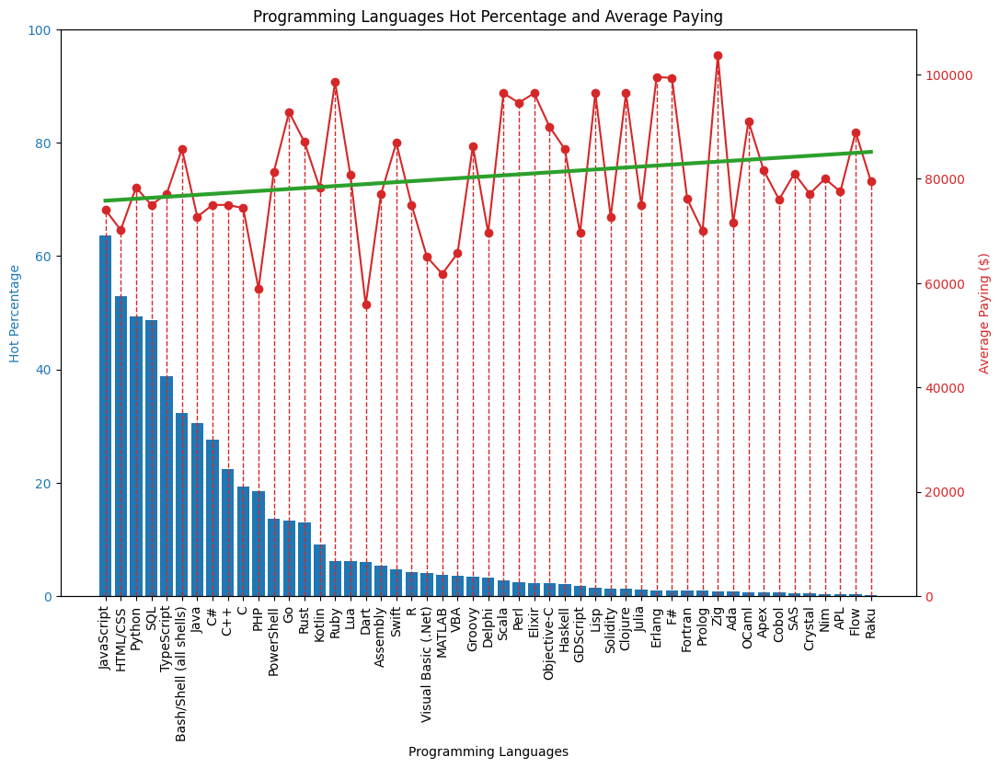

# 大數據分析專題

分析 2023 年，StackOverflow 平台上個語言的使用率以及頻均年薪。
分析產業趨勢以及學習願景。

## Requirements

```
pip install -r requirements.txt
```

## Run App

```
python3 __init__.py
python3 app.py
```

## Result

透過回歸直線可以得出，代碼使用率和平均年薪成反比的關係。

